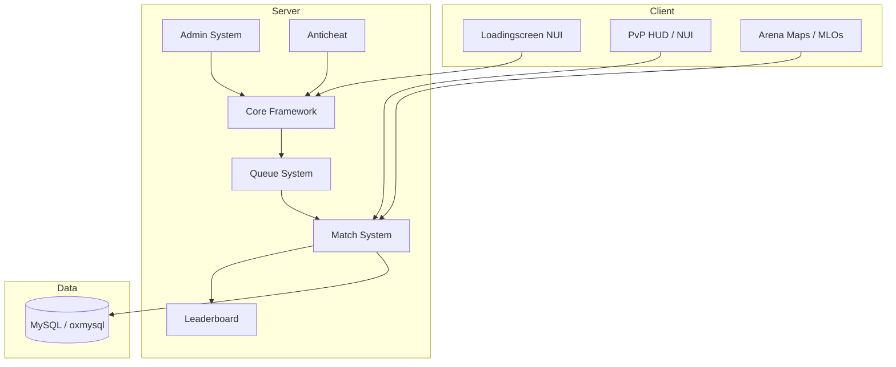
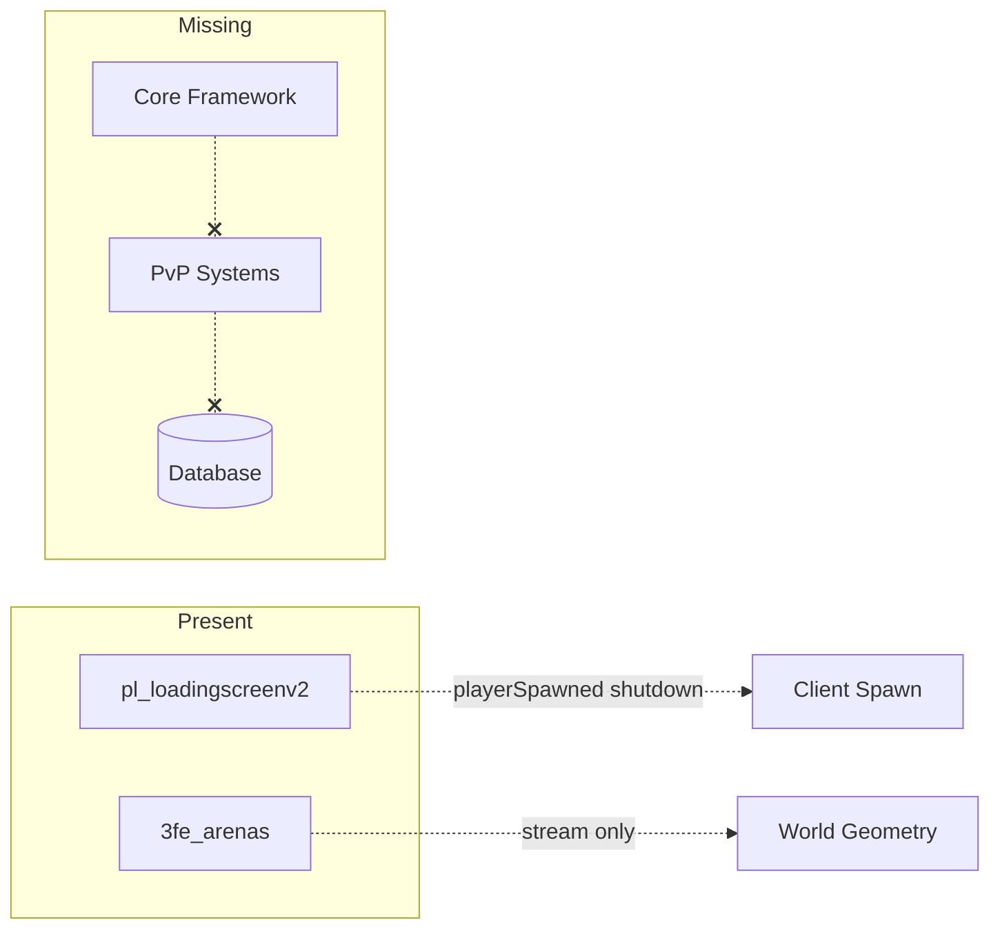

# PROJECT ARCHITECTURE

> FiveM PvP Server — Architecture document (initial state)  
> **Status:** INCOMPLETE — resources folder not present in workspace

---

## High-Level Architecture (target state)



---

## Current Architecture (as indexed)

Only two peripheral resources are indexed from remote branches. No core gameplay loop exists in the repo.



---

## Resource Categories

| Category | Status | Resources |
|----------|--------|-----------|
| **Maps / MLOs** | Partial | `3fe_arenas` (remote branch only) |
| **UI / NUI** | Partial | `pl_loadingscreenv2` (remote branch only) |
| **Loadingscreen** | Partial | `pl_loadingscreenv2` |
| **PvP / Match** | Missing | — |
| **Queue** | Missing | — |
| **Leaderboard** | Missing | — |
| **Admin** | Missing | — |
| **Inventory** | Missing | — |
| **Vehicles** | Missing | — |
| **Weapons** | Missing | — |
| **Anticheat** | Missing | — |
| **Database** | Missing | — |
| **Core Framework** | Missing | — |

---

## Resource: `3fe_arenas`

**Architecture role:** Static world geometry for PvP arena locations.

```
3fe_arenas/
├── fxmanifest.lua
└── stream/
    ├── 3fe_3vs3_r.ydr / .ymap / .ytyp
    ├── 3fe_arena_3_mini.ydr / .ymap
    ├── 3fe_india_arena_r.ydr / .ymap / .ytyp
    ├── 3fe_arenas.ytyp
    └── _manifest.ymf
```

- **No Lua logic** — pure streaming asset pack
- **data_file** declarations for `DLC_ITYP_REQUEST`
- Requires `dependency '/assetpacks'` (CFX Asset Escrow)
- Arena coordinates documented in `map_data.json` (branch)

**Integration points (when PvP core exists):**

- Match system should teleport players to arena coords from `map_data.json`
- Spawn points derived from ymap entity positions

---

## Resource: `pl_loadingscreenv2`

**Architecture role:** Pre-spawn loadscreen with NUI branding, music, social links.

```
pl_loadingscreenv2/
├── fxmanifest.lua
├── config.lua          # Config.EnableWaterMark
├── client.lua          # ShutdownLoadingScreenNui on spawn
├── server.lua          # Minimal replacement (escrowed original)
└── web/
    ├── index.html
    ├── style.css
    ├── script.js       # Obfuscated
    ├── config.js       # CONFIG object (server identity, theme, music)
    └── assets/
```

**Lifecycle:**

1. Player connects → FiveM shows `web/index.html` loadscreen
2. `loadscreen_manual_shutdown 'yes'` — client must call shutdown
3. `client.lua` listens `playerSpawned` → `ShutdownLoadingScreenNui()` + screen fade
4. NUI handles music, progress bar, staff list, social links (client-side only)

**Config surface (`web/config.js`):**

- `CONFIG.server` — name, tagline, logo
- `CONFIG.background` — video, overlay
- `CONFIG.theme` — colors
- `CONFIG.music` — playlist, autoplay, volume
- `CONFIG.social`, `CONFIG.staff`, `CONFIG.loading` — UI sections

---

## Dependency Graph (indexed resources)

```
/assetpacks (CFX escrow)
    ├── 3fe_arenas
    └── pl_loadingscreenv2
```

No inter-resource dependencies between indexed resources.

---

## Event Flow (indexed)

| Event | Direction | Resource | Handler |
|-------|-----------|----------|---------|
| `playerSpawned` | Client native | `pl_loadingscreenv2` | `client.lua` → shutdown loadscreen |

No custom `RegisterNetEvent` / `TriggerEvent` found in indexed Lua.

---

## Database Architecture

**None indexed.** No `.sql` files, no `oxmysql`/`mysql-async` usage found.

Expected tables for full PvP server (not yet present):

- `players` / `users`
- `matches` / `match_history`
- `leaderboard` / `stats`
- `bans` / `admin_logs`

---

## NUI Systems

| Resource | NUI Page | Callbacks |
|----------|----------|-----------|
| `pl_loadingscreenv2` | `web/index.html` | None registered in Lua (loadscreen-only, no `RegisterNUICallback`) |

`script.js` listens for `window message` events (`loadProgress`, etc.) — standard FiveM loadscreen protocol.

---

## Security / Production Notes

1. **FXAP escrow** — `3fe_arenas` .ydr files require Keymaster ownership
2. **Obfuscated JS** — `pl_loadingscreenv2/web/script.js` is minified/obfuscated
3. **No anticheat** indexed
4. **No server.cfg** — startup order unknown
5. Treat all future edits as production-impacting

---

## Recommended Server Startup Order (when full resources added)

```
# 1. Database / core
ensure oxmysql
ensure [framework]

# 2. Shared libs
ensure ox_lib

# 3. Maps
ensure 3fe_arenas

# 4. Gameplay
ensure [pvp-queue]
ensure [pvp-match]
ensure [leaderboard]

# 5. UI
ensure pl_loadingscreenv2

# 6. Admin / anticheat
ensure [admin]
ensure [anticheat]
```

*Order must be verified against actual `server.cfg` after resources are added.*

---

## File Type Inventory (workspace scan)

| Type | Count (main branch) | Count (indexed remote) |
|------|---------------------|------------------------|
| `fxmanifest.lua` | 0 | 2 |
| `.lua` | 0 | 4 |
| `.js` | 0 | 2 |
| `.html` | 0 | 1 |
| `.sql` | 0 | 0 |
| `.ymap` / `.ydr` / `.ytyp` | 0 | 12+ |
| TypeScript | 0 | 0 |
